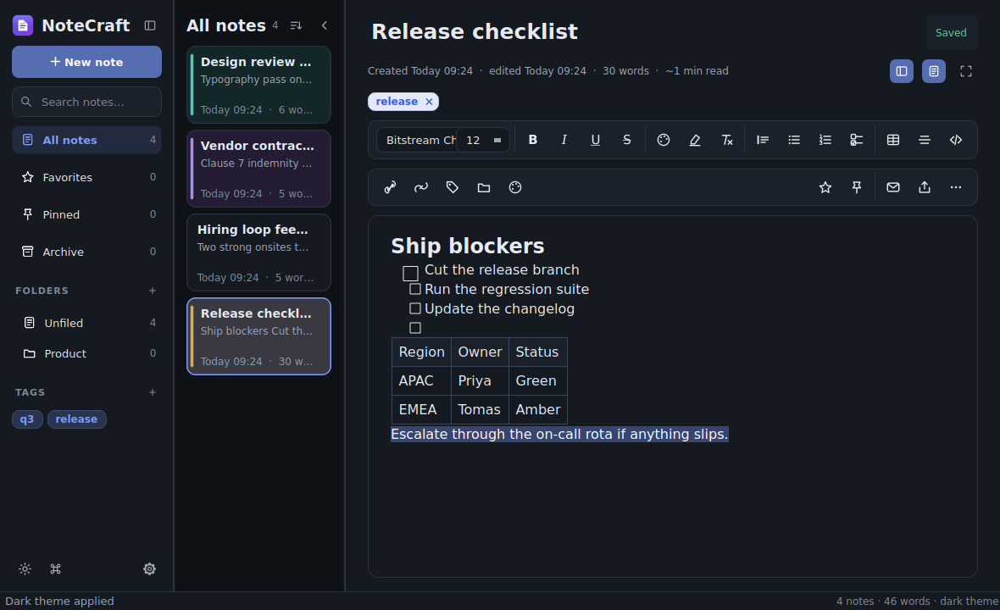
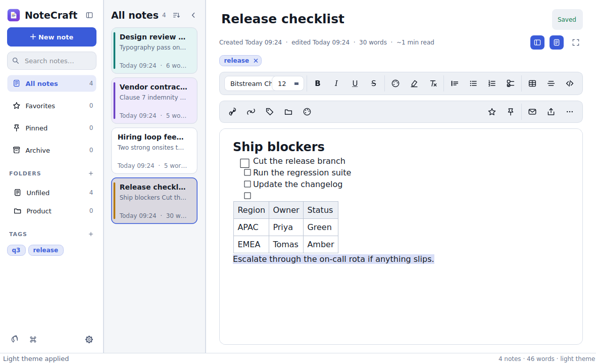
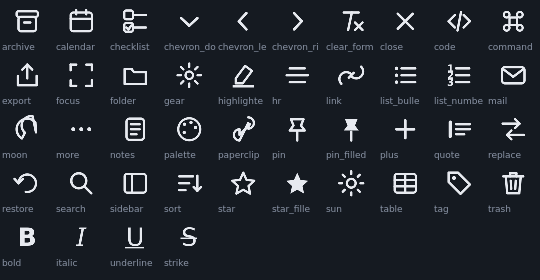

# NoteCraft

A fast, offline-first rich text notes app for Windows. One Python file, no installer,
no account, no network calls. Your notes live in a local SQLite database and never
leave your machine.



<details>
<summary>Light mode</summary>


</details>

---

## Install

**Download the release.** Grab `NoteCraft-windows.zip` from
[Releases](../../releases), extract it anywhere, and run `NoteCraft.exe`.
No installer, no admin rights.

**Or run from source.** Needs Python 3.10+.

```bash
pip install -r requirements.txt
python notecraft.py
```

On Windows you can just double-click `run.bat`.

---

## Features

**Writing** — bold, italic, underline, strikethrough, any font and size, text colour
and highlighting, headings, quotes, code blocks, bulleted and numbered lists,
tickable checklists, horizontal rules.

**Tables** — insert any size, add or delete rows and columns, restyle borders, or
select tab-separated text and convert it straight into a table.

**Organising** — folders, tags, favorites, pinning, priority levels, per-note card
and page colours, and an archive that holds notes before permanent deletion.

**Finding** — full-text search across every note (SQLite FTS5, with prefix matching),
find & replace inside a note, and a command palette on `Ctrl+K` covering every action
and every note.

**Getting things out** — export to PDF, HTML, Markdown or plain text, attach any
file by dragging it onto a note, add links, back everything up to a zip, or send a
note as an Outlook draft with its attachments already attached.

**Comfort** — dark and light themes that follow your system if you want, six accent
colours, focus mode, adjustable density, separate interface and editor fonts, and
session restore.

### Keyboard

| Shortcut | Action |
|---|---|
| `Ctrl+N` | New note |
| `Ctrl+K` | Command palette |
| `Ctrl+F` | Search all notes |
| `Ctrl+Shift+F` | Find in this note |
| `Ctrl+H` | Find & replace |
| `Ctrl+S` | Save now |
| `Ctrl+B` / `I` / `U` | Bold, italic, underline |
| `Ctrl+Shift+X` | Strikethrough |
| `Ctrl+Space` | Clear formatting |
| `Ctrl+Enter` | Toggle checkbox |
| `Ctrl+D` | Duplicate note |
| `Ctrl+E` | Email note |
| `Ctrl+P` | Export as PDF |
| `Ctrl+1` / `Ctrl+2` | Show or hide the panels |
| `F11` | Focus mode |
| `Ctrl+Shift+D` | Toggle theme |
| `Ctrl+Shift+P` / `S` / `A` | Pin, favorite, archive |
| `Ctrl+,` | Settings |

---

## Building the executable

```bash
build.bat
```

That installs the build dependencies, draws the icon, freezes the app, and strips
the Qt libraries NoteCraft never loads. Result: `dist\NoteCraft\NoteCraft.exe`.

Every push also builds on GitHub Actions, and tagging `v*` publishes a release
automatically:

```bash
git tag v3.0
git push origin v3.0
```

### Two things worth knowing if you fork this

**One-folder, not one-file.** A `--onefile` build unpacks its DLLs to `%TEMP%` on
every launch. Measured here, that costs roughly 5× the startup time, and on
machines running endpoint security it is slower still, because every extracted
file gets scanned. One-folder starts immediately and extracts nothing.

**`--exclude-module` does not shrink Qt.** It only removes *Python* modules, while
Qt's DLLs arrive as binary dependencies of `QtGui.pyd` and sail straight past it.
Step 4 of `build.bat` deletes them directly — about 40 MB, of which
`opengl32sw.dll` alone is 20 MB. If a build ever refuses to start on an unusual
machine such as a virtual desktop, `opengl32sw.dll` is the first thing to restore.

Do not add `--exclude-module urllib`. It looks harmless, but `pathlib` imports it
and the frozen app dies at startup with `No module named 'urllib'`.

---

## How it looks the way it does

The icon and all ~40 interface icons are drawn in code with `QPainter`, not loaded
from files. That is why the app ships as a single `.py` with no assets, and why the
icons stay sharp at any DPI and re-tint themselves whenever the theme changes.



Every colour comes from one token set. A single generated stylesheet and a matching
`QPalette` drive the whole interface, and the note cards, sidebar rows and tag chips
paint themselves from those same tokens on every repaint. Each foreground and
background pair is verified to clear the WCAG AA contrast threshold in both themes.

Note content gets the same treatment, which solves a problem most Qt note apps have.
`QTextEdit.toHtml()` bakes the *current palette* into the saved HTML, so a note
written in dark mode carries `color:#e0e0e0` forever and turns invisible on a white
background. NoteCraft strips palette-derived colours before saving, and on load it
walks every text run: greys inherited from an old theme are cleared so the text
follows the palette, while deliberate colours keep their hue and saturation and
shift only in lightness until they clear 4.5:1 against the page behind them.
Highlights and code blocks sitting on the wrong side of the page get flipped too.
Because the target depends only on the background, switching themes back and forth
returns the same colours instead of drifting.

---

## Your data

Everything lives in `%APPDATA%\NoteCraft\`:

```
notes.db          SQLite database (WAL mode)
attachments\      copies of the files you attach
error.log         only written if something goes wrong
```

Upgrading is just replacing the app folder — your notes are untouched.
**Settings → Data → Back up…** writes the database and every attachment to a zip.

If a save ever fails, NoteCraft writes your text to `unsaved-<id>-<time>.txt` in
that folder before showing the error, and offers a one-click repair.

---

## Contributing

Issues and pull requests are welcome. Keep it to a single file, no new runtime
dependencies beyond PyQt6, and run `python -m pyflakes notecraft.py` before opening
a PR — CI runs it and will fail the build otherwise.

## Licence

MIT — see [LICENSE](LICENSE).
